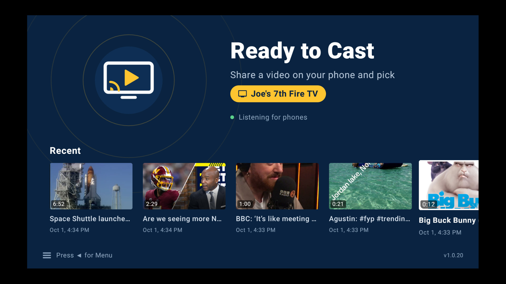
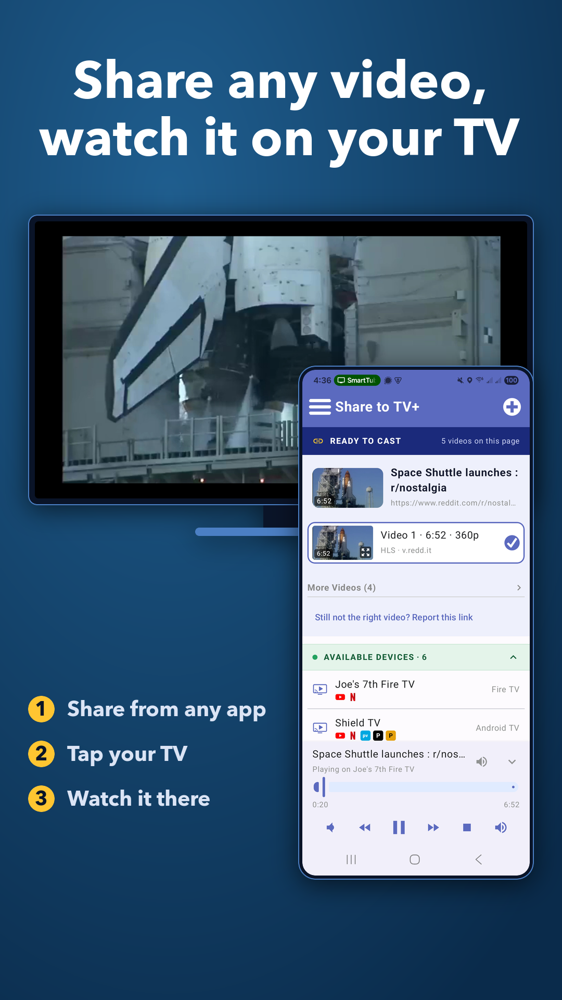
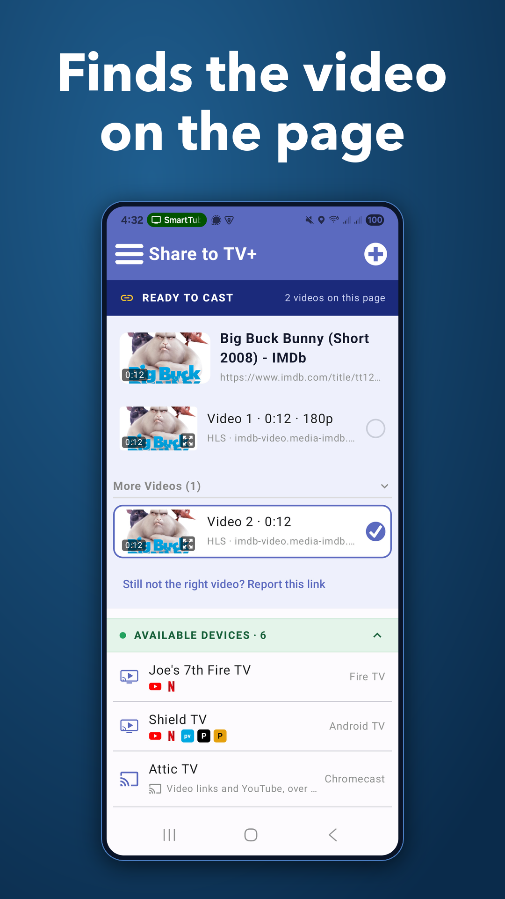
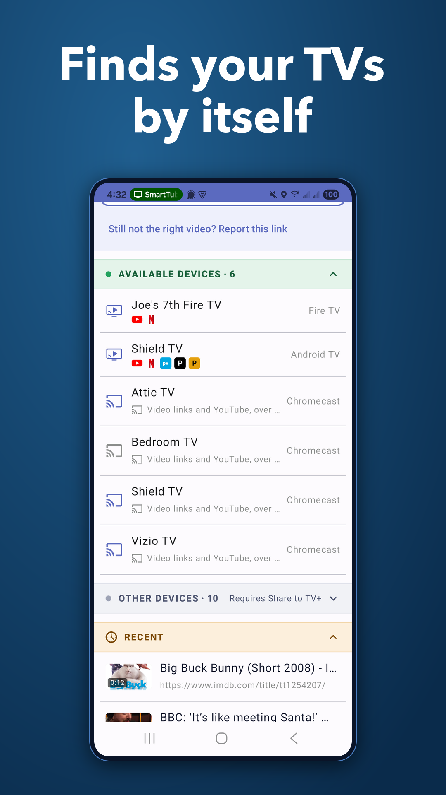
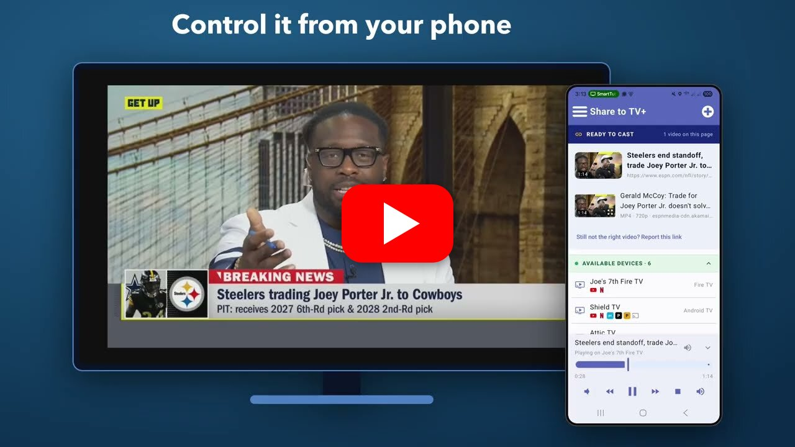
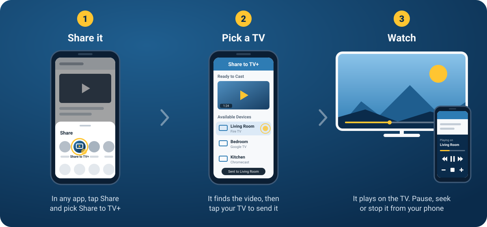

# Share to TV+

**Share a video from any app and watch it on your TV**

<!-- shields.io has no Android TV, Fire TV or Windows logo any more: Android TV uses Google TV's, and
     Fire TV + Windows carry their own (a TV / four panes, base64 SVG in the logo= param) -->

---

## What is it?

Share to TV+ is an app that lets you **share a video from any app on your phone, tablet or desktop and watch it on your TV**. 

It works with Fire TV, Google TV, Android TV, Chromecast, and smart TVs with YouTube.

## Why you might like it

This is an app created out of a frustration I've had trying to watch videos from my phone or laptop on TV.

I've got several Fire TV sticks and various Android/Google TV's. The Fire TV sticks don't support cast at all. Android TV has cast built-in, but it only works with a few apps that have a cast button. If I want to cast a video from a browser the only option I have is to cast the entire screen. But, that's more of a 'mirror' than a cast -- my laptop has to stay open and the video quality is terrible & laggy.

I wanted to find an easier way. I know there are other similar apps like this one - I tried a few a while back that didn't work very well or were fairly old and not maintained as often as something like this probably needs to be. So, it made for a great project to take on and I think I have a lot I can add (see #About Me)

---

## Screenshots

### TV

 

### Phone

## Video

---

## Features

- **Works from almost any app**: anything with a **Share** button
- **Finds the video for you**: most apps share a link to a *page*, not the video itself. Share to TV+
  opens the page and pulls the video out
- **Opens YouTube** links in your favorite YouTube app (supports SmartTube if installed)
- **Opens Netflix** and several other DRM links (Prime Video, Disney+, etc) in the official app if installed 
- **Plays on the TVs you already have**: Fire TV, Google TV, Android TV, Chromecast, and smart TVs
  with YouTube
- **Phone not needed once shared**: the TV plays the video straight from the site. Once it's sent, you can
  lock your phone or keep using it
- **Plays local media too!**: pick a video from your phone's gallery, Google Photos or similar, and it streams to the TV
- **A remote in your pocket**: pause, skip, seek, mute or stop from your phone
- **Recent History**: quickly access videos you've recently shared

---

## How to use it

---

## Install

Share to TV+ is **free** on GitHub today. It's the same APK for phones, tablets and TVs, and it checks for 
updates itself: you'll be told in the app when there's a new version.

<h3>Android phone / tablet</h3>

- Download [**ShareToTV.apk**](https://github.com/jpage4500/ShareToTV/releases/download/android/ShareToTV.apk)
  on the phone and open it. Android asks once to allow installs from your browser

<h3>Fire TV / Google TV / Android TV</h3>

1. Install the **Downloader** app on the TV (search for it in the TV's app store)
2. Fire TV only: let Downloader install apps in **Settings ▸ My Fire TV ▸ Developer Options**
3. In Downloader, enter code `8355506` to download and install

Or, just download and install the same apk as the phone: [**ShareToTV.apk**](https://github.com/jpage4500/ShareToTV/releases/download/android/ShareToTV.apk)

<h3>Desktop (Mac / Windows / Linux)</h3>

- [GitHub release page](https://github.com/jpage4500/ShareToTV/releases/latest): pick the installer
  for your computer. The desktop app updates itself when a new version comes out
- Optionally install the Chrome extension (coming soon) which will send the current link to the app, saving a step

<h3>Coming soon</h3>

- **Google Play** (phones and Google TV / Android TV)
- **Amazon Appstore** (Fire TV)
- **App Store** (iPhone and iPad)
- **Apple TV** support
- **Chrome Browser Extension**

Right now it's all free (no ads either). The plan it to get it into the Google Play Store, Amazon App Store and Apple App Store, but I imagine it's going to take them a while to approve an app like this. I'll likely add a small one time in-app purchase but if you're able to help me test and give feedback I'm open to giving out free codes for the store versions once they're ready. There's an internal test track on Google Play Store too which if you DM me your email address I'll add you. Once you're on the list you can access it [here](https://play.google.com/apps/internaltest/4700955142052814381)

It's still in beta - there's a million sites that host video and most of them don't make it easy to figure out the stream so it can be played by another player. I've only tested a few of them so there's going to be lots of fixes needed early on. What I can promise is that I'll test the URL's that get reported to me and if it's possible to support I'll support them.
The store versions may come with a small one-time purchase. The GitHub version will stay free for now. Donations are  much appreciated - [PayPal](https://www.paypal.com/paypalme/jpage4500) or [Venmo](https://www.venmo.com/u/jpage4500)

---

## About Me

I've been a developer for 20+ years. I am passionate about the products I work on and work to make them
the best in class any way that I can. AI has undoubtedly changed the programming landscape forever, and
I'm embracing it head-on. I know what I want in an app and AI allows me to get there 1000 times faster
than doing it myself. While that also means anyone can create an app from scratch today, I know what
features should look like, how to provide excellent support, and how to keep the code from getting
unmanageable. I will NEVER release any AI SLOP. Software can work differently for different people so
maintaining it is critical for making it last.

---

## Support

Found a bug, a site that doesn't work, or want something added?

Send feedback from the app (**☰ menu ▸ Support**). If a link didn't work, tap **Report this link**
under it: that sends me what was shared and what Share to TV+ found, so I can fix that site.

I try to be very responsive to support or bug requests. If it's something that's feasible and makes
sense to add, I'll do it.
