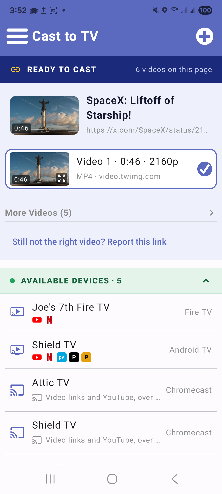
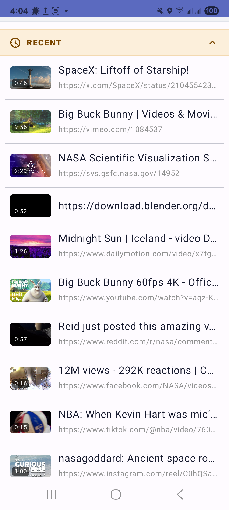
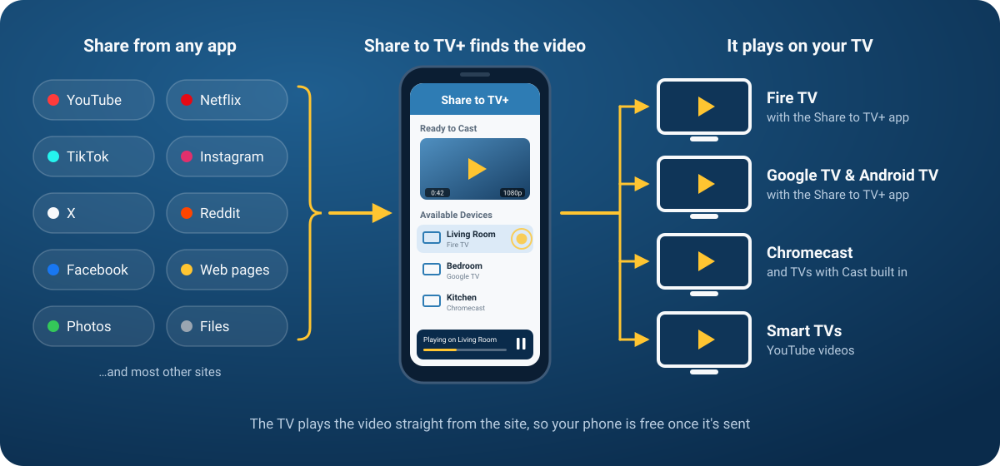

# Share to TV+

**Share a video from any app and watch it on your TV**

<!-- shields.io has no Android TV, Fire TV or Windows logo any more: Android TV uses Google TV's, and
     Fire TV + Windows carry their own (a TV / four panes, base64 SVG in the logo= param) -->

**Coming soon...** 

---

## What is it?

Share to TV+ is an app that lets you **share a video from any app on your phone, tablet or desktop and watch it on your TV**. 

It works with Fire TV, Google TV, Android TV, Chromecast, and smart TVs with YouTube.

---

## Screenshots

### TV

 

### Phone

## Video

---

## How it works

---

## Why you might like it

You find a great video on your phone and want it on the big screen, but the app you're in has no
cast button. Or it has one that only works with one brand of TV.

**Share to TV+ fills that gap.** Share the video (or the page it's on) to Share to TV+, tap your TV, and
it plays there. No copying links, and no hunting for the same video again on the TV's remote.

- **Works from almost any app**: anything with a **Share** button
- **Finds the video for you**: most apps share a link to a *page*, not the video itself. Share to TV+
  opens the page and pulls the video out
- **Plays on the TVs you already have**: Fire TV, Google TV, Android TV, Chromecast, and smart TVs
  with YouTube
- **Phone not needed once shared**: the TV plays the video straight from the site. Once it's sent, you can
  lock your phone or keep using it
- **Plays local media too!**: pick a video from your phone's gallery, Google Photos or similar, and it streams to the TV
- **A remote in your pocket**: pause, skip, seek, mute or stop from your phone
- **Recent History**: quickly access videos you've recently shared

---

## How to use it

### Set up your TV

For the best results, install **Share to TV+ on your TV**. It's the same app, and on a TV it becomes
the player that waits for videos from your phone.

- **Fire TV**: install Share to TV+ on the TV and open it once. After that you never have to open
  it yourself: sending a video opens it for you
- **Google TV, Android TV**: install Share to TV+ on the TV. Until the Google Play version is out,
  open it on the TV before you send (the Play version will open by itself, like Fire TV)
- **Chromecast** (and TVs with Chromecast built in): nothing to install
- **Other smart TVs**: nothing to install, but they can only take YouTube videos

Your phone and your TV need to be on the **same Wi-Fi network**.

### Every time: share, tap, watch

1. **Share it.** In any app (a browser, TikTok, Instagram, Reddit, X, your gallery…) tap **Share**
   and pick **Share to TV+**. No Share button? Copy the link and tap **+ ▸ Paste Link** in Share to TV+.
2. **Pick a TV.** Share to TV+ finds the video on the page. If there's more than one, pick the right
   one; each shows its length and quality, and tapping a thumbnail previews it on your phone. Then
   tap your TV.
3. **Watch.** It starts playing on the TV. The **Now Playing** bar at the bottom of your phone lets
   you pause, skip back and forward, seek, mute, change the volume or stop.

That's it. The TV's remote works too: play, pause and seek from the couch.

---

## What it can do

### Send almost anything

- **Links from any app**, even when the app shares a whole sentence with the link buried in it
- **Web pages**: Share to TV+ reads the page to find its video. Pages that build their player in
  code are loaded in the background until the video shows up
- **Your own videos**: pick one from your phone's gallery or files and it streams to the TV
- **Short links** (like `share.google`, `bit.ly` or `t.co`) are followed to where they lead

### Works with the sites you use

| Site | What happens |
|---|---|
| **YouTube** | Opens in the TV's YouTube app (or Smarttube if installed) |
| **Netflix, Prime Video, Disney+, Max, Hulu, Peacock, Paramount+, Apple TV, Plex, Tubi, Pluto TV, Crunchyroll, Twitch** | Opens in that app on the TV, on the show or movie where it can |
| **TikTok** | Plays on the TV |
| **Instagram & Facebook** | Reels and videos play with sound. Instagram, and private Facebook posts, need you to sign in once in **Settings ▸ Signed-In Sites** |
| **X / Twitter** | Plays at the best quality the post has |
| **Reddit** | Plays with sound |
| **Everything else** | Share to TV+ looks for the video on the page and lists what it finds |

### Finds your TVs by itself

- Every TV on your Wi-Fi shows up on its own. There's nothing to pair or type in
- Each TV shows the streaming apps it has (YouTube, Netflix, Prime Video, Disney+, Hulu, Max…)
- TVs you've sent to before sit at the top, and they show up as soon as the app opens
- Devices that can't play anything are tucked away under **Other Devices**
- Long-press a TV to see its details: model, maker, IP address and apps

### Remembers what you shared

- **Recent** keeps the last 20 things you shared, with thumbnails and lengths. Tap one to send it
  again
- On the TV, press **◀** on the remote for a menu with its own **Recent** list, to replay what was
  sent to it

### Relays when it has to

Some videos only play for the app that asked for them, and a phone's gallery isn't something a TV
can reach. For those, your phone passes the video along to the TV as it plays. You'll see a
notification while it does, and Share to TV+ tells you when to keep your phone on and nearby.

---

## Which TVs work

| TV | What you need | What you can send |
|---|---|---|
| **Fire TV** | Share to TV+ installed on the TV | Everything, plus it opens by itself when you send |
| **Google TV / Android TV** | Share to TV+ installed on the TV | Everything. Open the app on the TV first until the Play version is out |
| **Chromecast** & TVs with Chromecast built in | Nothing | Video links and YouTube |
| **Other smart TVs** with YouTube | Nothing | YouTube videos |
| **Apple TV, Roku** | | Not yet |

**Sending from:** Android phones and tablets, and desktop (Mac, Windows, Linux). On desktop,
Share to TV+ uses your Chrome or Edge in the background for pages that need it, and to sign in to
Instagram and Facebook. iPhone and iPad are on the way.

---

## Your privacy

- **No account, no sign-up.** Open it and go.
- **Nothing goes through a server of ours.** The video goes from the site to your TV, or through
  your own phone when it's relayed.
- **Sign-ins stay on your phone.** If you sign in to Instagram or Facebook, that's between your phone
  and them. Sign out any time in **Settings ▸ Signed-In Sites**.

---

## Install

Share to TV+ is **free** on GitHub today. It's the same APK for phones, tablets and TVs, and it checks for 
updates itself: you'll be told in the app when there's a new version.

<h2>Android phone / tablet</h2>

- Download [**ShareToTV.apk**](https://github.com/jpage4500/ShareToTV/releases/download/android/ShareToTV.apk)
  on the phone and open it. Android asks once to allow installs from your browser

<h2>Fire TV / Google TV / Android TV</h2>

1. Install the **Downloader** app on the TV (search for it in the TV's app store)
2. Fire TV only: let Downloader install apps in **Settings ▸ My Fire TV ▸ Developer Options**
3. In Downloader, enter
   `https://github.com/jpage4500/ShareToTV/releases/download/android/ShareToTV.apk`
   and install it

That link always gets the newest version.

<h2>Desktop (Mac / Windows / Linux)</h2>

- [GitHub release page](https://github.com/jpage4500/ShareToTV/releases/latest): pick the installer
  for your computer. The desktop app updates itself when a new version comes out

<h2>Coming soon</h2>

- **Google Play** (phones and Google TV / Android TV), the **Amazon Appstore** (Fire TV) and the
  **App Store** (iPhone and iPad)
- **Apple TV** support
- The store versions may come with a small one-time purchase. The GitHub version will stay free but donations are appreciated.

---

## About Me

I've been a developer for 20+ years. I am passionate about the products I work on and work to make them
the best in class any way that I can. AI has undoubtedly changed the programming landscape forever, and
I'm embracing it head-on. I know what I want in an app and AI allows me to get there 1000 times faster
than doing it myself. While that also means anyone can create an app from scratch today, I know what
features should look like, how to provide excellent support, and how to keep the code from getting
unmanageable. I will NEVER release any AI SLOP. Software can work differently for different people so
maintaining it is critical for making it last.

---

## Support

Found a bug, a site that doesn't work, or want something added?

Send feedback from the app (**☰ menu ▸ Support**). If a link didn't work, tap **Report this link**
under it: that sends me what was shared and what Share to TV+ found, so I can fix that site.

I try to be very responsive to support or bug requests. If it's something that's feasible and makes
sense to add, I'll do it.
